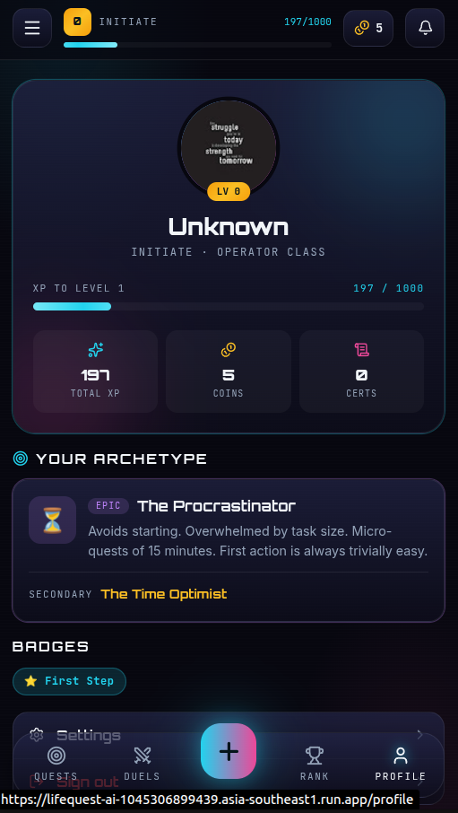

# LifeQuest AI — Project Description

**Team / Author:** ami4go
**Hackathon:** Vibe2Ship 2026

| Submission Item | Link |
|---|---|
| **Deployed App** | https://lifequest-ai-1045306899439.asia-southeast1.run.app |
| **GitHub Repo** | https://github.com/ami4go/LifeQuest |
| **User Study** | [Survey Link](https://docs.google.com/forms/d/e/1FAIpQLSeBqRJQCVbBWFNhE5ZKi5eyNYj8RxQGI_RvApxpjswvTRWIQA/viewform) |

---

## 1. Problem Statement Selected

**The Last-Minute Life Saver.**

Students, professionals, and entrepreneurs frequently miss deadlines, assignments, and commitments. Existing tools rely on passive reminders that are easy to ignore. The real bottleneck isn't forgetting — it's **hesitation**: the moment a person opens a task, feels overwhelmed, and closes it without acting. Over time this compounds into full procrastination and a cycle of guilt.

---

## 2. Solution Overview

**LifeQuest AI** reframes productivity as a role-playing game. Instead of nagging, it converts goals into a game world — **missions, quests, XP, ranks, coins, and PvP duels** — with **Google Gemini** as the autonomous agent at the center.

When a user enters a goal and deadline, Gemini decomposes it into a personalized mission tree calibrated to the user's diagnosed *procrastination archetype*. The AI then continuously:
- **Plans the day** to hit nearest deadlines
- **Verifies submitted work** with multimodal evaluation and rewards quality
- **Detects hesitation** and proposes the **Smallest Next Action** to restore momentum
- **Decides fair penalties** based on task difficulty and user history
- **Recognizes off-platform achievements** and rewards them — sometimes secretly

We also integrated **Human Momentum Theory** — adding Temperature Indicators (🔥/🌊/🧊), Hesitation Window Detection, and a Reality Feed to catch users *before* they fully procrastinate.

  
  
  
  

<em>Dashboard • Duels Arena • Leaderboard • Profile</em>

---

## 3. Key Features

### AI / Agentic Capabilities (Gemini-Powered)

- **AI Goal Decomposition** — Goal + deadline → structured mission tree of difficulty-rated, time-estimated quests.
- **Archetype Engine** — 8-question onboarding diagnoses procrastination type; AI tailors every quest and tip accordingly.
- **AI Daily Planner** — Prioritizes the day to beat closest deadlines with archetype-aware guidance.
- **AI Proof Verification** — Multimodal evaluation of uploaded work (image/PDF/text), scored 1–5 with feedback, awarding XP + coins. Acts as an **impartial AI evaluator** for fairness.
- **Hesitation Detection** — Detects repeated avoidance, diagnoses the cause, and restructures the quest via the Smallest Next Action.
- **AI-Decided Penalties** — Fair HP/coin loss computed from task complexity and user track record.
- **Certificate Scoring** — Verifies uploaded certificates and awards 1–500 coins by significance.
- **Secret Achievements** — Silently tracks grind and unlocks hidden badges at thresholds.

### Procrastination Archetypes

The AI diagnoses which archetype fits the user during onboarding. All quests and interventions are then personalized:

| Archetype | Pattern | AI Adaptation |
|---|---|---|
| 🏖️ **Procrastinator** | Avoids starting; overwhelmed by size | Micro-quests of 15 min; trivially easy first step |
| 🎯 **Perfectionist** | Won't ship until "perfect" | "Good enough" checkpoints; rewards progress over polish |
| ⏰ **Time Optimist** | Underestimates duration | Buffer time added; hard tasks front-loaded |
| 📦 **Overloaded** | Says yes to everything | Ruthless prioritization; suggests drops/delegation |
| 😴 **Low Motivation** | Knows what to do, can't start | Smallest possible steps; heavy early XP rewards |

### Human Momentum Theory Integration

- **Value Before Setup** — Onboarding asks *"What goal worries you most?"* — relief before configuration.
- **Temperature Indicators** — 🔥 Hot / 🌊 Stable / 🧊 Cooling per quest (progress vs. time). Softer nudge than "OVERDUE."
- **Hesitation Window** — Repeated opens without completion → "Smallest Next Action" modal.
- **Reality Feed** — Notifications reframed as active momentum record.

### Gamification & Engagement

- **Quest → Mission → Challenge** hierarchy — clean dashboard, details on drill-down
- **Auto-Completion** — last challenge done → mission + quest auto-complete
- **Quest History** — Ongoing / Completed / Dropped sections on a dedicated page
- **Focus Lock** — +50% XP on time, −25% if missed
- **Duels Arena** — PvP with AI-evaluated submissions, scorecards, instant winner
- **Coins & Rewards** — Earn → redeem merch → full transaction history
- **Badge Redemption Arc** — Swap penalty badges for antidotes to recover profile score + bonus coins
- **Global Leaderboard**, **Accent Themes**, **Voice Input**

---

## 4. Technologies Used

- **Frontend:** React 19, Vite 8, React Router 7
- **UI Design:** Stitch (UI design & logo generation), Custom CSS, `lucide-react` icons
- **AI SDK:** `@google/genai` (Google Gemini `gemini-2.5-flash`)
- **Backend:** Firebase Authentication, Cloud Firestore (real-time), Google Cloud Run
- **Web APIs:** Web Speech API (voice goal entry)

---

## 5. Google Technologies Utilized

- **Google Gemini API (`gemini-2.5-flash`)** — Agentic core of the product. Every intelligent action is a structured Gemini call using **text and vision** (multimodal): goal decomposition, work evaluation, daily planning, penalty decisions, hesitation diagnosis, certificate scoring, and duel-challenge generation.

- **Firebase (Google Cloud):**
  - **Firebase Authentication** with **Google Sign-In (OAuth 2.0)** — one-tap onboarding.
  - **Cloud Firestore** — real-time data (quests, duels, coins, badges) via live `onSnapshot` listeners.

- **Google Cloud Run** — Deployed production build.

- **Google AI Studio** — Prompt design, testing, and primary dev/deploy environment.

- **Stitch** — UI design and logo generation for the console-grade cyber aesthetic.

---

*LifeQuest AI — turning the dread of a deadline into the dopamine of a quest.*
