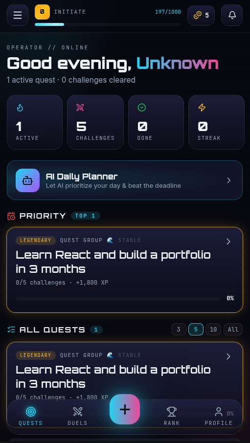
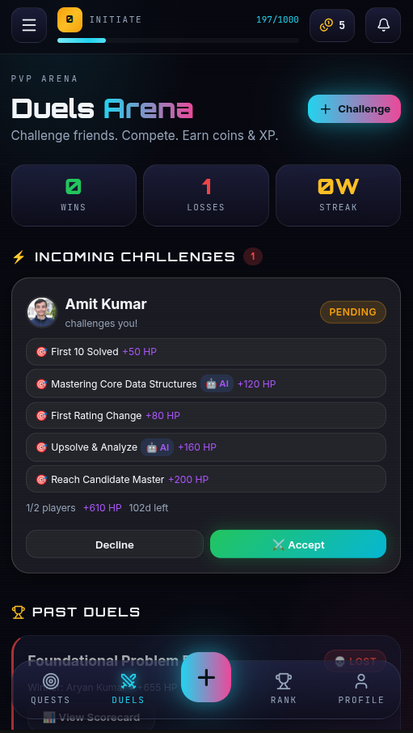
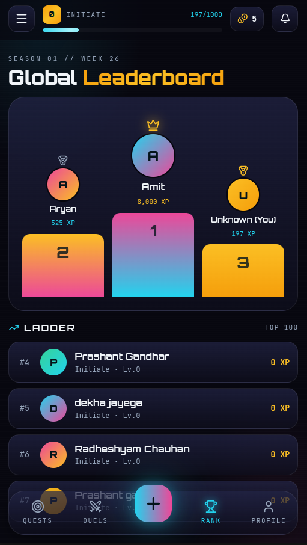
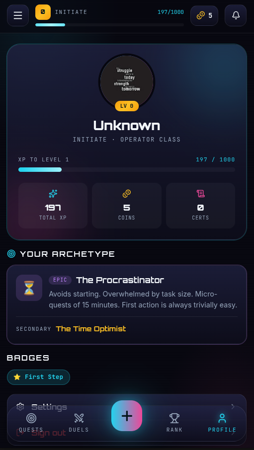
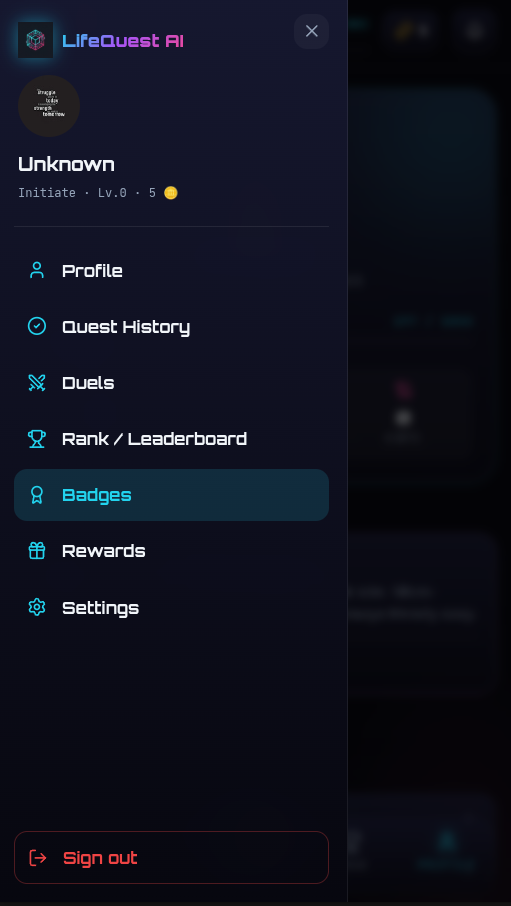

# ⚡ LifeQuest AI — A Game Engine for Real-Life Goals

> Stop escaping into games to feel achievement. **Start achieving in reality.**

LifeQuest AI turns real-life goals into a role-playing game — **missions, quests, XP, ranks, coins, duels, and boss-grade deadlines** — with **Google Gemini** as the autonomous engine that decomposes goals, evaluates work, decides penalties, plans your day, and awards hidden achievements.

Built for **Vibe2Ship 2026** — Problem Statement: *The Last-Minute Life Saver*.

🔗 **Live App:** https://lifequest-ai-1045306899439.asia-southeast1.run.app

📦 **Repo:** https://github.com/ami4go/LifeQuest

📝 **User Study:** https://forms.gle/NFJmCvDLEwDUe8XJ8

> ** For Best experience use it on a mobile phone!**

---

## 📸 Screenshots

<p align="center">
  
  
  
  
</p>
<p align="center">
  <em>Dashboard &nbsp;•&nbsp; Duels Arena &nbsp;•&nbsp; Global Leaderboard &nbsp;•&nbsp; Profile & Archetypes</em>
</p>

---

## 🎯 The Problem

Passive reminders don't work. The real barrier isn't forgetting — it's **hesitation**: that moment you open a task, feel overwhelmed, and close it without acting. LifeQuest AI uses AI to **plan, prioritize, motivate, and verify** — turning deadline-dread into quest-dopamine. It also integrates **Human Momentum Theory** to detect hesitation *before* it becomes procrastination.

---

## ✨ Key Features

### 🧠 Agentic AI (Gemini-Powered)

| Feature | What It Does |
|---|---|
| **AI Goal Decomposition** | Type or *speak* a goal + deadline → Gemini creates a structured mission tree of difficulty-rated, time-estimated quests |
| **Archetype Engine** | 8-question onboarding diagnoses your procrastination type; AI tailors every quest and tip to *your* failure mode |
| **AI Daily Planner** | One-tap agent that prioritizes your day to beat closest deadlines with archetype-aware tips |
| **AI Proof Verification** | Upload work (image/PDF/text) → multimodal Gemini scores 1–5 with feedback, then awards XP + coins |
| **Hesitation Detection** | Detects repeated avoidance, diagnoses *why*, proposes the **Smallest Next Action** to restore momentum |
| **AI-Decided Penalties** | Weighs task complexity + your track record for **fair** HP/coin loss — not a flat fee |
| **Certificate Scoring** | Upload a certificate → AI verifies & awards 1–500 coins by significance |
| **Secret Achievements** | AI silently tracks your grind & unlocks hidden badges when you hit thresholds |

### 🧬 Procrastination Archetypes

During onboarding, the AI diagnoses which archetype fits you. Every quest, tip, and intervention is then personalized:

| Archetype | Behavior Pattern | How AI Adapts |
|---|---|---|
| 🏖️ **The Procrastinator** | Avoids starting; overwhelmed by task size | Micro-quests of 15 min; first action is always trivially easy |
| 🎯 **The Perfectionist** | Won't ship until it's "perfect" | Sets "good enough" checkpoints; rewards progress over polish |
| ⏰ **The Time Optimist** | Underestimates how long things take | Adds buffer time; front-loads hard tasks early in the schedule |
| 📦 **The Overloaded** | Says yes to everything; drowns in tasks | Ruthless prioritization; suggests tasks to drop or delegate |
| 😴 **Low Motivation** | Knows what to do, just can't start | Smallest possible first steps; heavy XP rewards for early momentum |

<p align="center">
  
</p>
<p align="center"><em>Your diagnosed archetype appears on your Profile page</em></p>

### 🌡️ Human Momentum Theory

Beyond standard gamification, we integrated behavioral science to address the root psychology of procrastination:

- **Value Before Setup** — Onboarding asks *"What goal worries you most?"* upfront — relief before configuration.
- **Temperature Indicators** — Dashboard shows 🔥 Hot / 🌊 Stable / 🧊 Cooling per quest based on progress vs. time elapsed. A "cooling" tag is a softer nudge than "OVERDUE."
- **Hesitation Window** — Detects repeated opens without completions → triggers "Smallest Next Action" modal.
- **Reality Feed** — Notification panel reframed as active momentum record, not passive activity log.

### 🎮 Gamification & Engagement

- **Quest → Mission → Challenge** hierarchy keeps the dashboard clean; details on drill-down only
- **Auto-Completion** — finishing the last challenge auto-completes the mission and quest (no extra button)
- **Quest History** — Completed/Dropped quests moved to a separate page (Ongoing / Completed / Dropped)
- **Focus Lock** — Bet on yourself: +50% XP on time, −25% if missed
- **Duels Arena** — PvP challenges with AI-evaluated submissions, live scorecards, instant winner resolution
- **Coins & Rewards** — Earn from evaluated work, redeem merch, full transaction history
- **Badge Redemption Arc** — Swap penalty badges for antidote badges to recover your profile score + bonus coins
- **Global Leaderboard** — Podium + ladder ranked by XP
- **Accent Themes** — Personalize your dashboard color

<p align="center">
  
  
  
</p>
<p align="center"><em>Dashboard &nbsp;•&nbsp; Duels Arena &nbsp;•&nbsp; Side Menu</em></p>

---

## 🛠️ Tech Stack

| Layer | Technology |
|---|---|
| **AI** | Google Gemini (`gemini-2.5-flash`) via `@google/genai` — multimodal text + image |
| **Auth** | Firebase Authentication (Google Sign-In / OAuth 2.0) |
| **Database** | Cloud Firestore (real-time `onSnapshot` listeners) |
| **Hosting** | Google Cloud Run (via Google AI Studio) |
| **Frontend** | React 19, Vite 8, React Router 7 |
| **UI Design** | **Stitch** (UI design & logo generation), Custom CSS, `lucide-react` icons |

### 🟦 Google Technologies

- **Gemini API** — agentic core: decomposition, evaluation, planning, penalties, hesitation diagnosis, certificate scoring, duel generation (text + vision)
- **Firebase** — Auth (Google Sign-In), Firestore (real-time data), Cloud Run (deployment)
- **Google AI Studio** — prompt design, testing, and primary dev/deploy environment
- **Stitch** — UI design and logo generation for the console-grade cyber aesthetic

---

## 🚀 Run Locally

```bash
git clone https://github.com/ami4go/LifeQuest.git
cd LifeQuest/app
npm install
```

Create `.env` in the `app/` folder:
```env
VITE_GEMINI_API_KEY=your_key
VITE_FIREBASE_API_KEY=your_key
VITE_FIREBASE_AUTH_DOMAIN=your_project.firebaseapp.com
VITE_FIREBASE_PROJECT_ID=your_project_id
VITE_FIREBASE_STORAGE_BUCKET=your_project.firebasestorage.app
VITE_FIREBASE_MESSAGING_SENDER_ID=your_sender_id
VITE_FIREBASE_APP_ID=your_app_id
```

```bash
npm run dev   # opens at localhost:5173
```

---

## 🏆 Evaluation Criteria Mapping

| Criterion | How LifeQuest AI Delivers |
|---|---|
| **Agentic Depth** | Gemini autonomously decomposes, evaluates, penalizes, plans, detects hesitation, and awards hidden badges |
| **Problem Solving** | Attacks deadline-missing at the root: hesitation detection + smallest next action + AI planner |
| **Innovation** | Archetype personalization, Focus-Lock stakes, AI-judged duels, badge Redemption Arc, Temperature indicators |
| **Google Technologies** | End-to-end on Gemini + Firebase + Cloud Run + AI Studio + Stitch |
| **Product Experience** | Mobile-first, console-grade UI with live HUD, clean hierarchy, instant feedback |
| **Technical Implementation** | Context/service architecture, real-time Firestore, structured-JSON AI calls with fallbacks |

---

*Built with ⚡ for Vibe2Ship 2026.*
